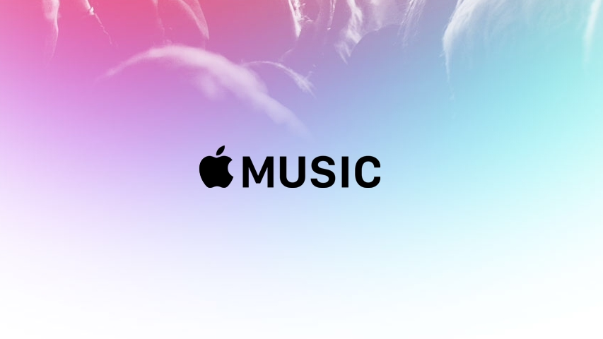

# Dance Only to Your Tunes !- Music Streaming Application

<dl>
<dt>Course Name</dt>
<dd>Algorithmic Problem Solving</dd>
<dt>Course Code</dt>
<dd>23ECSE309</dd>
<dt>Name</dt>
<dd>Prashant Konaraddi</dd>
<dt>University</dt>
<dd>KLE Technological University, Hubballi-31</dd>
</dl>

* * *

> The new era of music streaming !
>
> PK :-))

## Note:
#### This Portfolio presents:-

1. [Introduction](https://github.com/prashantvk1803/Aps_portfolio.github.io/blob/main/index.md)
2. [Why Portfolio](https://github.com/prashantvk1803/Aps_portfolio.github.io/blob/main/whyportfolio.md)
3. [Functionalities, Analysis and code](#analysis-and-code-examples)
4. [References](#references)
