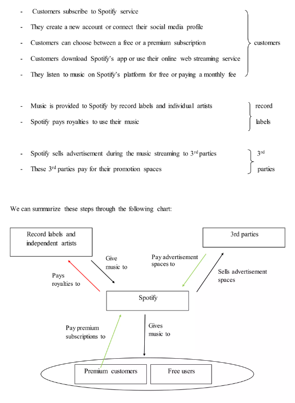
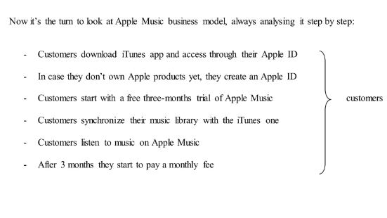
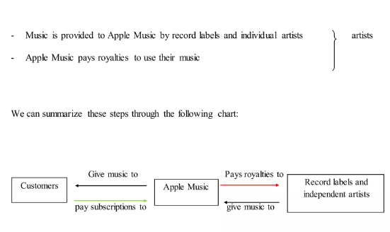
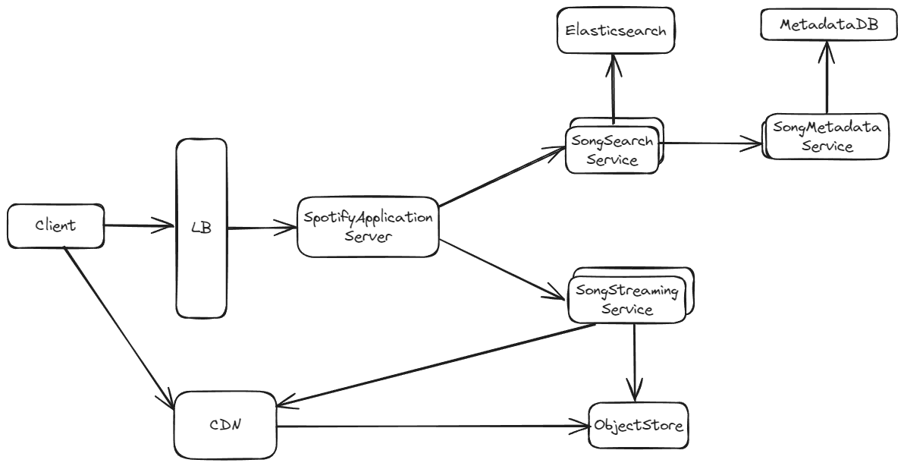

# Introduction 

## 1. Exploring the Domain

* **Shift in Music Consumption**:
   The evolution of music consumption has shifted significantly with the advent of digital platforms, allowing users instant access to vast libraries of music.

* **Data-Driven Personalization**:
   Music streaming services leverage data analytics to offer personalized experiences and recommendations, enhancing user engagement.

* **Advanced Algorithms**:
   The adoption of advanced algorithms for content delivery, user behavior analysis, and personalized recommendations has become pivotal for these platforms.

* **Integration with Smart Devices**:
   The rise of smart devices and voice-activated assistants has further integrated music streaming into everyday life.

* **Rich Landscape for Problem-Solving**:
   The complexity of user preferences and streaming logistics offers a rich landscape for algorithmic problem-solving, providing opportunities to optimize operational efficiencies, enhance user experiences, and drive innovation in digital music consumption.

## 2. Market Area Analysis

* **Rapid Growth**:
   The global music streaming market is experiencing rapid growth, driven by increasing internet penetration and smartphone usage.

* **Current Trends**:
  - Personalization through AI and machine learning
  - High-fidelity audio streaming
  - Integration with social media for sharing and discovery
  - Offline listening capabilities
  - Use of blockchain for artist royalties and transparent transactions
  - Effective digital marketing 

* **Market Projection**:
   The music streaming market is projected to reach a substantial market size, driven by innovation and consumer demand for seamless access to music.

## 3. Major Market Players

1. Spotify
2. Apple Music
3. Amazon Music
4. YouTube Music
5. Tidal
6. Deezer

## 4. Business Model Analysis of Top Two Platforms

### 1. Spotify

 
 
Spotify's business model exemplifies the "freemium" strategy, blending free and premium services. Their revenue sources and expenses, depicted by green and red arrows respectively in their chart, showcase a balanced approach. The platform offers basic features for free with ads, while premium subscribers enjoy ad-free listening, offline access, and higher audio quality. This model effectively builds a large user base without heavy investment in advertising.
The crucial relationship between Spotify and its customers forms the foundation of their business model, catering to a wide range of listeners from casual to audiophiles. Industry data suggests freemium applications generate significant revenue in app stores, making it a robust model for the digital age and allowing Spotify to maintain steady revenue while fostering potential growth.

### 2. Apple Music

 
The sources of revenue for the company come no more from 3rd parties but they are all fruit of the paid subscriptions of Apple Music users. The company management refused to adopt a freemium strategy as a sign of respect for the work of the artists, which considers to be undervalued if given for free to users. "Freemium companies are building an audience on the back of the artist" said Apple Music CEO in a speech to the audience at a Vanity Fair event in San Francisco (Statt, The Verge, 2015).

## 5. High Level Design

 

#### Components

##### 1. SpotifyWebServer
- **Description**: Acts as a Backend-for-Frontend (BFF) that performs authorization, rate limiting, and other validations.
- **Responsibilities**:
  - User authentication and authorization
  - Rate limiting
  - Request validation

##### 2. LoadBalancer
- **Description**: Distributes incoming network traffic across multiple servers to ensure no single server becomes overwhelmed.
- **Responsibilities**:
  - Distribute incoming requests evenly across servers
  - Improve application reliability and availability
  - Optimize resource use and reduce latency

##### 3. SongSearchService
- **Description**: Service used to return the query result for song searches by users.
- **Responsibilities**:
  - Process user search queries
  - Interface with Elasticsearch for fast search results

##### 4. Elasticsearch
- **Description**: An indexing service used to speed up the search results on song names, artists, lyrics, or other metadata.
- **Responsibilities**:
  - Create an index of all searchable content
  - Enable quick retrieval of search results

##### 5. SongMetadataService
- **Description**: Service that provides APIs for getting data from the MetadataDB.
- **Responsibilities**:
  - Fetch song metadata
  - Interface with MetadataDB

##### 6. MetadataDB
- **Description**: System of record for the songs metadata.
- **Responsibilities**:
  - Store and manage song metadata
  - Provide reliable and consistent access to metadata

##### 7. SongStreamingService
- **Description**: Service used to get the song audio file for streaming.
- **Responsibilities**:
  - Fetch audio files for streaming
  - Interface with ObjectStore and CDN

##### 8. ObjectStore
- **Description**: System of record for the audio files.
- **Responsibilities**:
  - Store audio files
  - Ensure high availability and durability of audio files

##### 9. CDN (Content Delivery Network)
- **Description**: Caches songs for better latency.
- **Responsibilities**:
  - Cache audio files for quick access
  - Reduce latency by serving cached content to users

